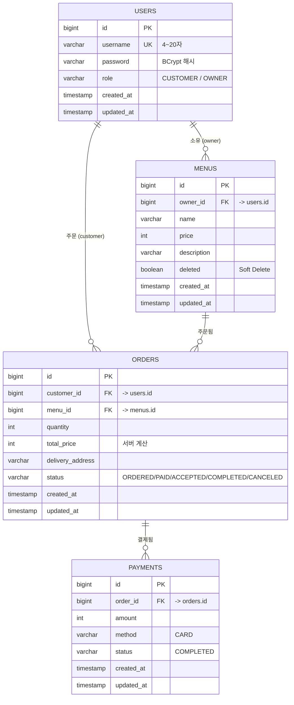
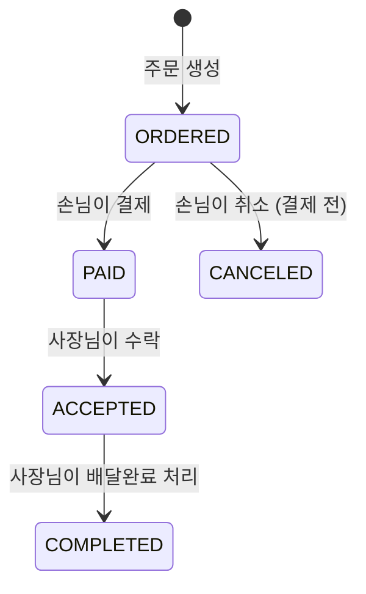

# deliveryService

사장님이 메뉴를 올리고, 손님이 주문·결제하고, 사장님이 주문을 처리하는 작은 배달 주문 서비스 백엔드 API입니다.

## 기술 스택

- Java 21
- Spring Boot 4.1.x (Web, Data JPA, Security, Validation)
- PostgreSQL 18
- JWT (jjwt)
- Gradle

## 실행 방법

### 1. PostgreSQL 준비 (Docker)

```bash
docker run --name delivery-db \
  -e POSTGRES_USER=delivery \
  -e POSTGRES_PASSWORD=delivery1234 \
  -e POSTGRES_DB=delivery \
  -p 5432:5432 \
  -d postgres:18
```

### 2. 애플리케이션 실행

```bash
./gradlew bootRun
```

`src/main/resources/application.yml`에서 DB 접속 정보를 확인/수정할 수 있습니다.

## ERD



## 주문 상태 흐름



## 사용자 역할

| 역할 | 할 수 있는 것 |
| --- | --- |
| `CUSTOMER` | 메뉴 조회 · 주문 생성 · 주문 취소 · 결제 · 내 주문 조회 |
| `OWNER` | 메뉴 등록·수정·삭제 · 내 메뉴에 들어온 주문 조회 · 주문 상태 변경 |