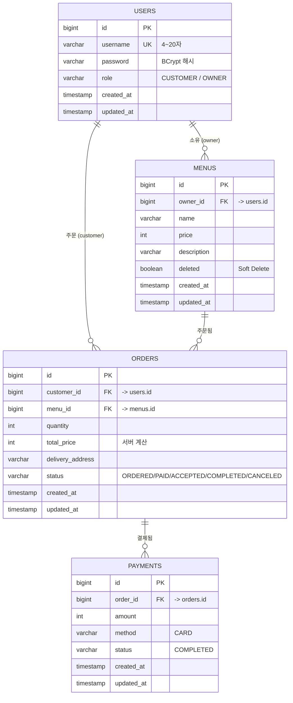
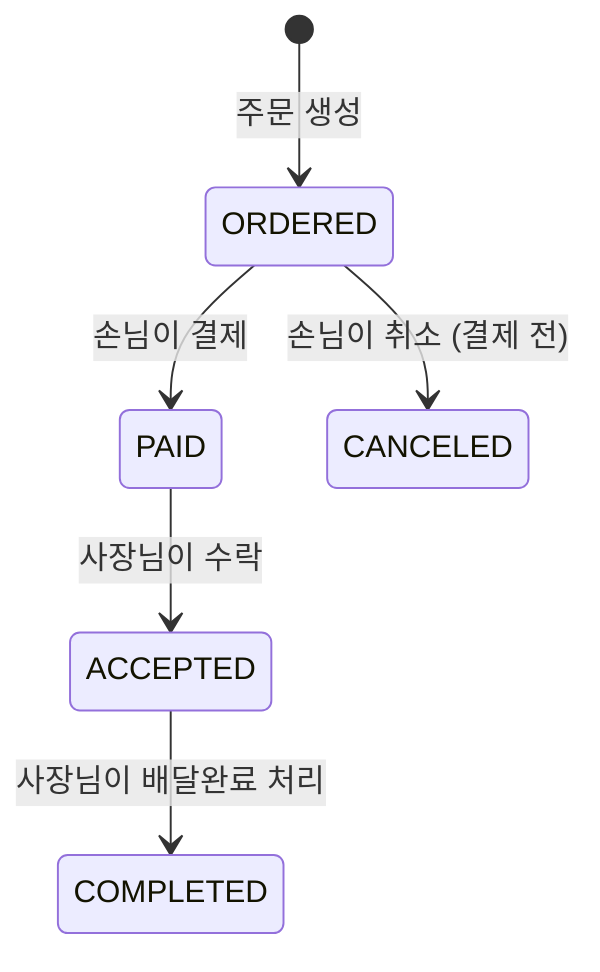

# deliveryService

사장님이 메뉴를 올리고, 손님이 주문·결제하고, 사장님이 주문을 처리하는 작은 배달 주문 서비스 백엔드 API입니다.

## 기술 스택

- Java 21
- Spring Boot 4.1.x (Web, Data JPA, Security, Validation)
- PostgreSQL 18
- JWT (jjwt)
- Gradle

## 실행 방법

### 1. PostgreSQL 준비 (Docker)

```bash
docker run --name delivery-db \
  -e POSTGRES_USER=delivery \
  -e POSTGRES_PASSWORD=delivery1234 \
  -e POSTGRES_DB=delivery \
  -p 5432:5432 \
  -d postgres:18
```

### 2. 애플리케이션 실행

```bash
./gradlew bootRun
```

`src/main/resources/application.yml`에서 DB 접속 정보를 확인/수정할 수 있습니다.

서버 실행 중에는 아래 주소에서 Swagger UI로 직접 API를 테스트할 수 있습니다.

```
http://localhost:8080/swagger-ui/index.html
```

## API 명세

| # | 기능 | Method & URL | 권한 | 성공 | 주요 실패 |
| --- | --- | --- | --- | --- | --- |
| 1 | 회원가입 | `POST /api/users` | 누구나 | 201 | 400(검증 실패) · 409(아이디 중복) |
| 2 | 로그인 | `POST /api/auth/login` | 누구나 | 200 | 401(아이디/비밀번호 불일치) |
| 3 | 메뉴 등록 | `POST /api/menus` | OWNER | 201 | 400(검증 실패) · 403(CUSTOMER 요청) |
| 4 | 메뉴 목록 조회 | `GET /api/menus` | 누구나 | 200 | - |
| 5 | 메뉴 단건 조회 | `GET /api/menus/{menuId}` | 누구나 | 200 | 404(없거나 삭제된 메뉴) |
| 6 | 메뉴 수정 | `PATCH /api/menus/{menuId}` | OWNER(본인) | 200 | 400 · 403(본인 메뉴 아님) · 404 |
| 7 | 메뉴 삭제 (Soft Delete) | `DELETE /api/menus/{menuId}` | OWNER(본인) | 204 | 403(본인 메뉴 아님) · 404 |
| 8 | 주문 생성 | `POST /api/orders` | CUSTOMER | 201 | 400(검증 실패) · 403(OWNER 요청) · 404(없는 메뉴) |
| 9 | 주문 목록 조회 | `GET /api/orders` | 로그인 사용자 | 200 | 역할별로 다른 목록 반환 |
| 10 | 주문 취소 | `PATCH /api/orders/{orderId}/cancel` | CUSTOMER(본인) | 204 | 403(본인 주문 아님) · 409(ORDERED 아닌 상태) |
| 11 | 주문 상태 변경 | `PATCH /api/orders/{orderId}/status` | OWNER(본인) | 200 | 403(본인 메뉴 아님) · 409(허용 안 된 전이) |
| 12 | 결제 | `POST /api/orders/{orderId}/payments` | CUSTOMER(본인) | 201 | 400(카드 외 수단) · 403(본인 주문 아님) · 409(ORDERED 아닌 상태) |

## ERD



## 주문 상태 흐름



## 사용자 역할

| 역할 | 할 수 있는 것 |
| --- | --- |
| `CUSTOMER` | 메뉴 조회 · 주문 생성 · 주문 취소 · 결제 · 내 주문 조회 |
| `OWNER` | 메뉴 등록·수정·삭제 · 내 메뉴에 들어온 주문 조회 · 주문 상태 변경 |